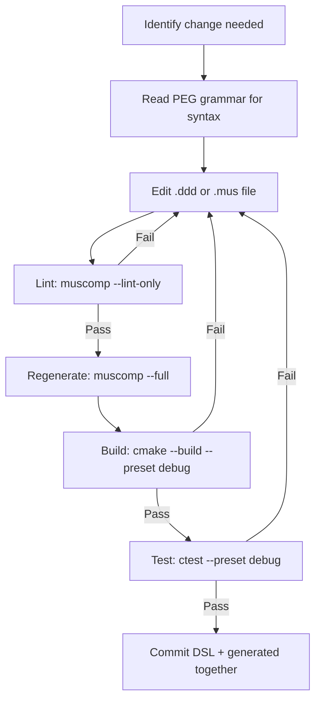

# Skill: Modify DSL

Use this skill when making any changes to `.ddd` or `.mus` files.
This is the master reference for DSL modifications.

## Before Any DSL Edit

1. **Read the PEG grammar** for definitive syntax:
   - Location: `share/muscomp/grammar/muscovite.peg` (in Conan package)
   - The grammar is the single source of truth for valid syntax
2. **Read `doc/DSL-QUICK-REFERENCE.md`** for `.ddd` construct examples
3. **Read `doc/PROJECT-DSL-REFERENCE.md`** for `.mus` configuration
4. **Read `doc/TYPE-MAPPINGS.md`** to verify field types

## Modification Workflow



## Common Modifications

### Add a field to an entity

Edit the entity in the appropriate `.ddd` file:

```ddd
ENTITY Patient @UUID("existing-uuid") IDENTIFIED_BY id {
    id UUID @REQUIRED,
    name TEXT @REQUIRED,
    email Email,
    phone Phone,               -- ← new field
    date_of_birth Date

    DOC "A patient in the system."
}
```

**Rules**:
- Add new fields before the `DOC` clause
- Use valid types only (see `doc/TYPE-MAPPINGS.md`)
- Add `@REQUIRED` if the field must not be NULL
- Add `@UNIQUE` if the field must be unique
- Add `@SEARCHABLE` if the field should be full-text indexed

### Add a new bounded context

1. Create a new `.ddd` file in `contexts/`:

```ddd
CONTEXT NewContext @UUID("generate-uuidv4") {
    OWNER "Team Name"
    VISION "What this context manages"

    -- Entities, events, etc.
}
```

2. Reference it in `project.mus`:

```mus
CONTEXT_FILES {
    "contexts/existing.ddd"
    "contexts/new_context.ddd"    -- ← add here
}
```

### Add a relationship between entities

```ddd
RELATIONSHIPS {
    -- Add inside the CONTEXT that owns the FK field
    target_entity -> TargetContext.TargetEntity REQUIRED ONE
        VIA target_entity_id
        DOC "Describes why this relationship exists.";
}
```

**Critical rules**:
- The `VIA` field must exist as a `UUID` field on the entity
- Never rely on `_id` naming convention for FK inference
- Choose `REQUIRED`/`OPTIONAL` and `ONE`/`MANY` explicitly

### Add a capability

Edit `project.mus`:

```mus
CAPABILITIES {
    "security"
    "event_sourcing"
    "telemetry"
    "search"           -- ← add capabilities as needed
    "messaging"
}
```

Then regenerate with the corresponding muscomp flags:

| Capability | Required muscomp flag |
|------------|----------------------|
| `search` | `--search` |
| `messaging` | `--messaging` |
| `telemetry` | `--otel-conventions` |
| `event_sourcing` | (built into `--cpp-dba`) |
| `security` | (built into `--grpc`) |

### Add a lookup table

```ddd
LOOKUP_TABLE Priority {
    "low"      @UUID("generate-uuidv4") DOC "Low priority",
    "medium"   @UUID("generate-uuidv4") DOC "Medium priority",
    "high"     @UUID("generate-uuidv4") DOC "High priority",
    "critical" @UUID("generate-uuidv4") DOC "Critical priority"

    DOC "Task priority levels."
}
```

**Never use PostgreSQL ENUM or CHECK constraints.** Always use `LOOKUP_TABLE`.

### Add event sourcing to an aggregate

```ddd
SOURCED_EVENT EntityCreated @UUID("...") {
    entity_id UUID @REQUIRED,
    name TEXT @REQUIRED,
    created_at TIMESTAMPTZ @REQUIRED

    DOC "Initial creation event."
}

SOURCED_EVENT EntityUpdated @UUID("...") {
    entity_id UUID @REQUIRED,
    field_name TEXT @REQUIRED,
    new_value TEXT

    UPCAST FROM v1 {
        SET field_name = "unknown"
    }

    DOC "Field update event with schema evolution."
}
```

## Validation Checklist

After every DSL modification:

- [ ] All types are from `doc/TYPE-MAPPINGS.md`
- [ ] All entities have `IDENTIFIED_BY id` with `id UUID @REQUIRED`
- [ ] All FKs have explicit `RELATIONSHIPS {}` entries
- [ ] All new constructs have `@UUID` with fresh UUIDv4
- [ ] All constructs have `DOC` clauses
- [ ] `muscomp --lint-only` passes
- [ ] `muscomp --full --output generated/` succeeds
- [ ] `cmake --build --preset debug` succeeds
- [ ] `ctest --preset debug` passes

## Common Mistakes

| Mistake | Fix |
|---------|-----|
| Using `VARCHAR` | Use `TEXT` or `String` |
| Using `TIMESTAMP` | Use `TIMESTAMPTZ` or `DateTime` |
| Assuming `_id` creates FK | Add explicit `RELATIONSHIPS {}` |
| Using `ENUM` or `CHECK` for categories | Use `LOOKUP_TABLE` |
| Editing files in `generated/` | Edit `.ddd`/`.mus` and regenerate |
| Missing `@UUID` on construct | Generate a fresh UUIDv4 |
| Missing `DOC` clause | Add documentation to every construct |
