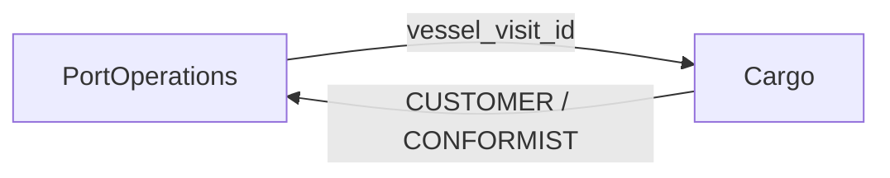

# ADR-002: Harbor Domain Bounded Context Boundaries

**Status:** Accepted
**Date:** 2026-04-12
**Context:** Domain decomposition for port operations

## Decision

The harbor domain is split into two bounded contexts:

1. **PortOperations** (Core) — Vessel scheduling, berth allocation, vessel visit lifecycle
2. **Cargo** (Supporting) — Cargo manifests, bill of lading, cargo item tracking

## Rationale

- **Vessel movement** and **cargo logistics** have different rates of change and different
  operational ownership (port authority vs. freight forwarders)
- The VesselVisit lifecycle (announced → berth_assigned → arrived → departed) is the
  central state machine; cargo tracking references visits but doesn't control them
- ISPS compliance requirements differ: cargo has stricter consignee tracking; vessels
  have IMO number verification
- Teams can evolve independently — PortOpsTeam owns scheduling, CargoTeam owns manifests

## Context Map

Cargo is downstream of PortOperations. Cargo manifests reference vessel visits by ID
but cannot modify vessel or berth state.

## Consequences

- Cross-context references use UUID foreign keys (vessel_visit_id), not shared entities
- Future contexts (e.g., Pilotage, Customs, Billing) can be added without restructuring
- Event-driven integration between contexts when needed (e.g., VesselDeparted → trigger cargo reconciliation)
