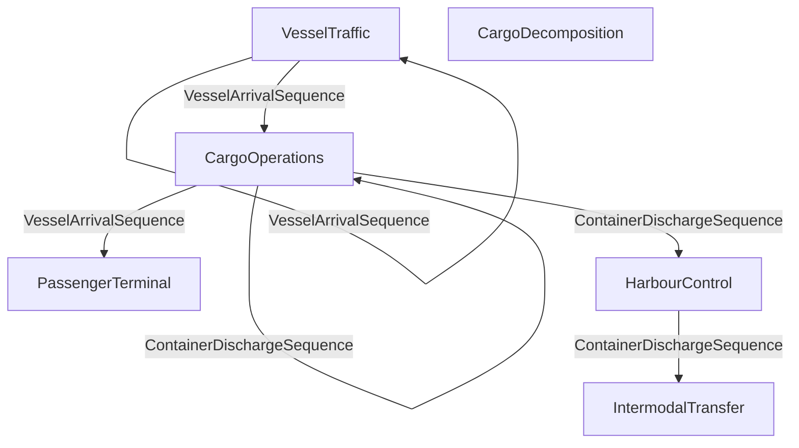
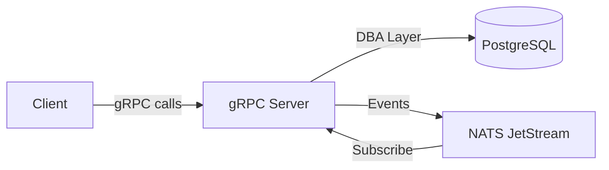

# Architecture Overview

> Generated by muscomp — DO NOT EDIT

## Project: MuscoviteHarbor

## Bounded Context Map

## Data Flow

## Context Summary

| Context | Entities | Events | Commands | Queries |
|---------|----------|--------|----------|--------|
| VesselTraffic | 6 | 5 | 2 | 0 |
| CargoOperations | 6 | 5 | 2 | 0 |
| PassengerTerminal | 3 | 3 | 0 | 0 |
| IntermodalTransfer | 5 | 5 | 0 | 0 |
| CargoDecomposition | 4 | 3 | 0 | 0 |
| HarbourControl | 4 | 2 | 0 | 0 |

## Technology Stack

| Layer | Technology |
|-------|------------|
| Domain Model | Muscovite DSL (.ddd) |
| Database | PostgreSQL 15+ |
| API | gRPC (Protocol Buffers) |
| Events | NATS JetStream |
| Build | CMake + Conan |
| Language | C++23 |
