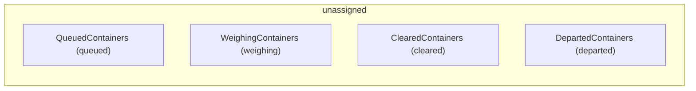

# Work Item Dependencies

```mermaid
graph LR
  subgraph unassigned
    intermodal_transfer_gate_processing_queued_containers["QueuedContainers (queued)"]
    intermodal_transfer_gate_processing_weighing_containers["WeighingContainers (weighing)"]
    intermodal_transfer_gate_processing_cleared_containers["ClearedContainers (cleared)"]
    intermodal_transfer_gate_processing_departed_containers["DepartedContainers (departed)"]
  end
```
