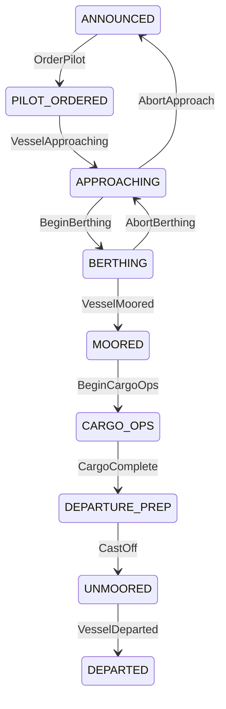
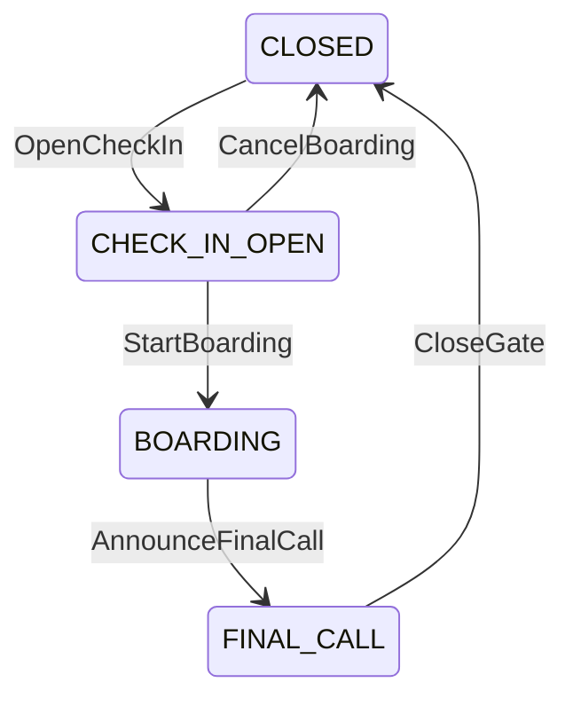
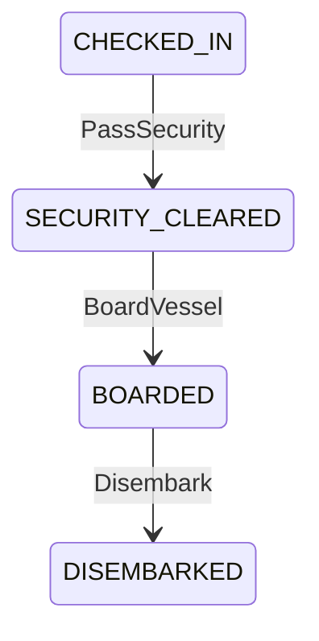

# Entity Reference

> Generated by muscomp — DO NOT EDIT

## Project: MuscoviteHarbor

## VesselTraffic Context

### Vessel

A registered vessel in the harbour traffic system

| Field | Type | Required | Description |
|-------|------|----------|-------------|
| id | UUID | ✓ | Primary key |
| id | UUID | ✓ |  |
| imo_number | IMONumber | ✓ |  |
| mmsi | MMSI | ✓ |  |
| call_sign | CallSign | ✓ |  |
| name | String | ✓ |  |
| vessel_type | String | ✓ |  |
| flag_state | String | ✓ |  |
| is_active | Boolean | ✓ |  |

**State Machine: VoyageStatus**

### Berth

A physical berth where vessels moor

| Field | Type | Required | Description |
|-------|------|----------|-------------|
| id | UUID | ✓ | Primary key |
| id | UUID | ✓ |  |
| code | BerthCode | ✓ |  |
| name | String | ✓ |  |
| max_loa_metres | Decimal | ✓ | Maximum vessel LOA this berth can accommodate |
| max_draft_metres | Decimal | ✓ | Maximum draft at lowest astronomical tide |
| max_beam_metres | Decimal | ✓ |  |
| has_crane_access | Boolean | ✓ |  |
| has_reefer_plugs | Boolean | ✓ |  |
| is_active | Boolean | ✓ |  |

**State Machine: VoyageStatus**

### Voyage

A single vessel call at the harbour

| Field | Type | Required | Description |
|-------|------|----------|-------------|
| id | UUID | ✓ | Primary key |
| id | UUID | ✓ |  |
| vessel_id | UUID | ✓ |  |
| berth_id | UUID |  |  |
| voyage_number | String | ✓ |  |
| eta | DateTime | ✓ |  |
| ata | DateTime |  |  |
| etd | DateTime |  |  |
| atd | DateTime |  |  |
| cargo_category | String | ✓ |  |
| status | String | ✓ |  |

**Relationships:**

- Voyage → `Vessel` (to-one)
- Voyage → `Berth` (to-one)

**State Machine: VoyageStatus**

### PilotAssignment

Assignment of a pilot to a voyage

| Field | Type | Required | Description |
|-------|------|----------|-------------|
| id | UUID | ✓ | Primary key |
| id | UUID | ✓ |  |
| voyage_id | UUID | ✓ |  |
| pilot_name | String | ✓ |  |
| pilot_zone | String | ✓ |  |
| boarding_time | DateTime |  |  |
| disembark_time | DateTime |  |  |

**Relationships:**

- PilotAssignment → `Voyage` (to-one)

**State Machine: VoyageStatus**

### TugBooking

Booking of a tug for vessel manoeuvring

| Field | Type | Required | Description |
|-------|------|----------|-------------|
| id | UUID | ✓ | Primary key |
| id | UUID | ✓ |  |
| voyage_id | UUID | ✓ |  |
| tug_name | String | ✓ |  |
| bollard_pull_t | Decimal | ✓ | Bollard pull in tonnes |
| is_confirmed | Boolean | ✓ |  |

**Relationships:**

- TugBooking → `Voyage` (to-one)

**State Machine: VoyageStatus**

### TideWindow

A tidal window with navigable draft at a specific berth

| Field | Type | Required | Description |
|-------|------|----------|-------------|
| id | UUID | ✓ | Primary key |
| id | UUID | ✓ |  |
| berth_id | UUID | ✓ |  |
| tide_height_metres | Decimal | ✓ | Predicted tide height above chart datum |
| available_draft | Decimal | ✓ | Effective navigable draft = berth depth + tide height |

**Relationships:**

- TideWindow → `Berth` (to-one)

**State Machine: VoyageStatus**

### Value Objects

#### Dimensions

| Field | Type | Required |
|-------|------|----------|
| loa_metres | Decimal | ✓ |
| beam_metres | Decimal | ✓ |
| draft_metres | Decimal | ✓ |

#### GeoPosition

| Field | Type | Required |
|-------|------|----------|
| latitude | Decimal | ✓ |
| longitude | Decimal | ✓ |

#### TimeWindow

| Field | Type | Required |
|-------|------|----------|
| window_start | DateTime | ✓ |
| window_end | DateTime | ✓ |

## CargoOperations Context

### Container

A shipping container in terminal operations

| Field | Type | Required | Description |
|-------|------|----------|-------------|
| id | UUID | ✓ | Primary key |
| id | UUID | ✓ |  |
| container_number | ContainerNumber | ✓ |  |
| size_category | String | ✓ |  |
| hazmat_class | String |  |  |
| voyage_id | UUID | ✓ |  |
| yard_slot_id | UUID |  |  |
| status | String | ✓ |  |

### YardSlot

A position in the container yard (bay-row-tier)

| Field | Type | Required | Description |
|-------|------|----------|-------------|
| id | UUID | ✓ | Primary key |
| id | UUID | ✓ |  |
| code | YardSlotCode | ✓ |  |
| max_weight_kg | Decimal | ✓ |  |
| max_tier | Integer | ✓ | Maximum stacking height |
| has_power | Boolean | ✓ | Has reefer power connection |
| is_occupied | Boolean | ✓ |  |

### Crane

A crane for container handling

| Field | Type | Required | Description |
|-------|------|----------|-------------|
| id | UUID | ✓ | Primary key |
| id | UUID | ✓ |  |
| name | String | ✓ |  |
| crane_type | String | ✓ |  |
| max_lift_kg | Decimal | ✓ |  |
| is_active | Boolean | ✓ |  |

### ReeferUnit

Refrigeration monitoring unit for a reefer container

| Field | Type | Required | Description |
|-------|------|----------|-------------|
| id | UUID | ✓ | Primary key |
| id | UUID | ✓ |  |
| container_id | UUID | ✓ |  |
| target_temp_c | Decimal | ✓ | Target temperature in Celsius |
| current_temp_c | Decimal |  |  |
| is_powered | Boolean | ✓ |  |

**Relationships:**

- ReeferUnit → `Container` (to-one)

### LoadPlan

Plan for loading/discharging containers for a voyage

| Field | Type | Required | Description |
|-------|------|----------|-------------|
| id | UUID | ✓ | Primary key |
| id | UUID | ✓ |  |
| voyage_id | UUID | ✓ |  |
| created_at | DateTime | ✓ |  |
| status | String | ✓ |  |

### DischargeSequence

Ordered sequence for container discharge

| Field | Type | Required | Description |
|-------|------|----------|-------------|
| id | UUID | ✓ | Primary key |
| id | UUID | ✓ |  |
| load_plan_id | UUID | ✓ |  |
| container_id | UUID | ✓ |  |
| sequence_order | Integer | ✓ |  |
| crane_id | UUID |  |  |

**Relationships:**

- DischargeSequence → `LoadPlan` (to-one)
- DischargeSequence → `Container` (to-one)
- DischargeSequence → `Crane` (to-one)

### Value Objects

#### ContainerDimensions

| Field | Type | Required |
|-------|------|----------|
| length_ft | Integer | ✓ |
| weight_kg | Decimal | ✓ |
| is_reefer | Boolean | ✓ |

## PassengerTerminal Context

### Passenger

A passenger travelling on a voyage

| Field | Type | Required | Description |
|-------|------|----------|-------------|
| id | UUID | ✓ | Primary key |
| id | UUID | ✓ |  |
| booking_ref | BookingReference | ✓ |  |
| passenger_type | String | ✓ |  |
| voyage_id | UUID | ✓ |  |
| status | String | ✓ |  |

**State Machine: GateStatus**

**State Machine: PassengerStatus**

### Gate

A physical gate in the passenger terminal

| Field | Type | Required | Description |
|-------|------|----------|-------------|
| id | UUID | ✓ | Primary key |
| id | UUID | ✓ |  |
| code | GateCode | ✓ |  |
| name | String | ✓ |  |
| capacity | Integer | ✓ | Maximum passengers in gate area |
| status | String | ✓ |  |
| voyage_id | UUID |  |  |

**State Machine: GateStatus**

**State Machine: PassengerStatus**

### BoardingPass

Issued boarding pass for a passenger

| Field | Type | Required | Description |
|-------|------|----------|-------------|
| id | UUID | ✓ | Primary key |
| id | UUID | ✓ |  |
| passenger_id | UUID | ✓ |  |
| gate_id | UUID |  |  |
| boarding_group | String | ✓ |  |
| seat_number | String |  |  |
| issued_at | DateTime | ✓ |  |
| scanned_at | DateTime |  |  |

**Relationships:**

- BoardingPass → `Passenger` (to-one)
- BoardingPass → `Gate` (to-one)

**State Machine: GateStatus**

**State Machine: PassengerStatus**

### Value Objects

#### PassengerName

| Field | Type | Required |
|-------|------|----------|
| given_name | String | ✓ |
| family_name | String | ✓ |

## IntermodalTransfer Context

### TransferSlot

A time slot for container transfer to outbound transport

| Field | Type | Required | Description |
|-------|------|----------|-------------|
| id | UUID | ✓ | Primary key |
| id | UUID | ✓ |  |
| reference | SlotReference | ✓ |  |
| container_id | UUID | ✓ |  |
| transport_mode | String | ✓ |  |
| scheduled_at | DateTime | ✓ |  |
| status | String | ✓ |  |

### TruckVisit

A truck arriving for container pickup

| Field | Type | Required | Description |
|-------|------|----------|-------------|
| id | UUID | ✓ | Primary key |
| id | UUID | ✓ |  |
| truck_plate | TruckPlate | ✓ |  |
| carrier_name | String | ✓ |  |
| slot_id | UUID | ✓ |  |
| arrived_at | DateTime |  |  |
| departed_at | DateTime |  |  |

**Relationships:**

- TruckVisit → `TransferSlot` (to-one)

### RailWagon

A rail wagon for container transport

| Field | Type | Required | Description |
|-------|------|----------|-------------|
| id | UUID | ✓ | Primary key |
| id | UUID | ✓ |  |
| wagon_number | String | ✓ |  |
| max_weight_kg | Decimal | ✓ |  |
| slot_id | UUID |  |  |

### BargeBooking

Booking for barge transport of containers

| Field | Type | Required | Description |
|-------|------|----------|-------------|
| id | UUID | ✓ | Primary key |
| id | UUID | ✓ |  |
| barge_name | String | ✓ |  |
| capacity_teu | Integer | ✓ |  |
| departure_at | DateTime | ✓ |  |
| status | String | ✓ |  |

### ChassisUnit

Chassis for container road transport

| Field | Type | Required | Description |
|-------|------|----------|-------------|
| id | UUID | ✓ | Primary key |
| id | UUID | ✓ |  |
| chassis_number | String | ✓ |  |
| chassis_type | String | ✓ |  |
| is_available | Boolean | ✓ |  |

## CargoDecomposition Context

### Pallet

A pallet extracted from a container

| Field | Type | Required | Description |
|-------|------|----------|-------------|
| id | UUID | ✓ | Primary key |
| id | UUID | ✓ |  |
| pallet_id | PalletId | ✓ |  |
| container_id | UUID | ✓ |  |
| weight_kg | Decimal | ✓ |  |
| length_cm | Decimal | ✓ |  |
| width_cm | Decimal | ✓ |  |
| height_cm | Decimal | ✓ |  |
| hs_code | HSCode | ✓ |  |

### Parcel

An individual parcel within a pallet

| Field | Type | Required | Description |
|-------|------|----------|-------------|
| id | UUID | ✓ | Primary key |
| id | UUID | ✓ |  |
| tracking_number | TrackingNumber | ✓ |  |
| pallet_id | UUID | ✓ |  |
| weight_kg | Decimal | ✓ |  |
| hs_code | HSCode | ✓ |  |
| description | String | ✓ |  |

**Relationships:**

- Parcel → `Pallet` (to-one)

### DeliveryUnit

Last-mile delivery unit dispatched from terminal

| Field | Type | Required | Description |
|-------|------|----------|-------------|
| id | UUID | ✓ | Primary key |
| id | UUID | ✓ |  |
| tracking_number | TrackingNumber | ✓ |  |
| destination | String | ✓ |  |
| carrier | String | ✓ |  |
| dispatched_at | DateTime |  |  |

**Relationships:**

- DeliveryUnit → `Parcel` (to-one)

### BreakBulkItem

Non-containerised cargo item requiring special handling

| Field | Type | Required | Description |
|-------|------|----------|-------------|
| id | UUID | ✓ | Primary key |
| id | UUID | ✓ |  |
| container_id | UUID | ✓ |  |
| item_type | String | ✓ |  |
| weight_kg | Decimal | ✓ |  |
| requires_crane | Boolean | ✓ |  |

### Value Objects

#### Dimensions

| Field | Type | Required |
|-------|------|----------|
| length_cm | Decimal | ✓ |
| width_cm | Decimal | ✓ |
| height_cm | Decimal | ✓ |

#### Weight

| Field | Type | Required |
|-------|------|----------|
| value_kg | Decimal | ✓ |

## HarbourControl Context

### SafetyZone

Designated safety zone within the port area

| Field | Type | Required | Description |
|-------|------|----------|-------------|
| id | UUID | ✓ | Primary key |
| id | UUID | ✓ |  |
| zone_code | ZoneCode | ✓ |  |
| zone_name | String | ✓ |  |
| security_level | String | ✓ |  |
| max_hazmat_class | Integer | ✓ |  |
| is_restricted | Boolean | ✓ |  |

### HazmatPermit

Hazmat handling permit issued by port authority

| Field | Type | Required | Description |
|-------|------|----------|-------------|
| id | UUID | ✓ | Primary key |
| id | UUID | ✓ |  |
| permit_number | PermitNumber | ✓ |  |
| vessel_id | UUID | ✓ |  |
| imo_class | Integer | ✓ |  |
| quantity_kg | Decimal | ✓ |  |
| approved | Boolean | ✓ |  |
| valid_from | DateTime | ✓ |  |
| valid_until | DateTime | ✓ |  |

### InvoiceLine

Port services invoice line item

| Field | Type | Required | Description |
|-------|------|----------|-------------|
| id | UUID | ✓ | Primary key |
| id | UUID | ✓ |  |
| vessel_id | UUID | ✓ |  |
| service_type | String | ✓ |  |
| amount | Decimal | ✓ |  |
| currency | String | ✓ |  |
| issued_at | DateTime | ✓ |  |

### PortCall

Read-only aggregation across VesselTraffic, CargoOps, and billing

*View entity (read-only)*

| Field | Type | Required | Description |
|-------|------|----------|-------------|
| id | UUID | ✓ | Primary key |
| id | UUID | ✓ |  |
| vessel_name | String | ✓ |  |
| imo_number | String | ✓ |  |
| berth_code | String |  |  |
| arrival_time | DateTime |  |  |
| departure_time | DateTime |  |  |
| container_count | Integer | ✓ |  |
| hazmat_permits | Integer | ✓ |  |
| total_billed | Decimal | ✓ |  |

---

**Summary**: 28 entities, 170 fields across 6 bounded contexts
