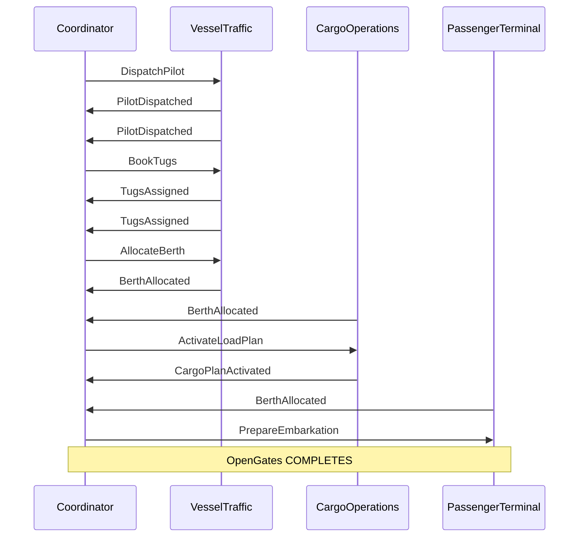
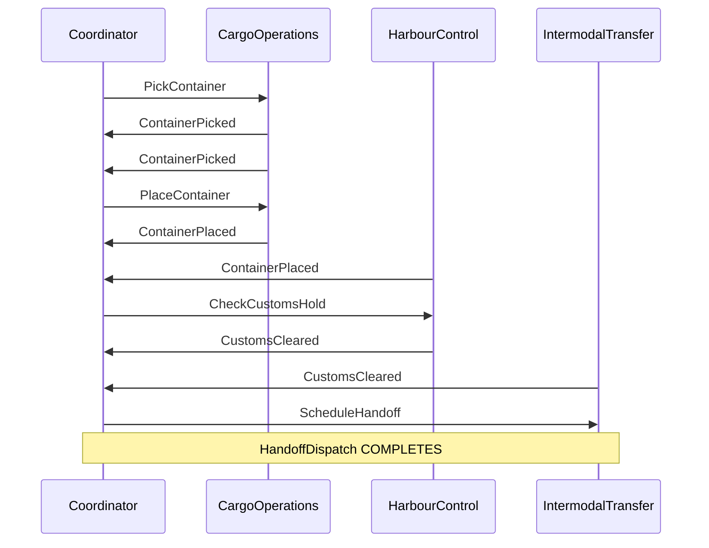

# Cross-Context Coordination Diagrams

> Auto-generated from COORDINATION definitions (FTR-869)

## VesselArrivalSequence

Full vessel arrival: pilot → tug → berth → gangway → cargo plan

## ContainerDischargeSequence

Container discharge: crane → yard → customs → intermodal

