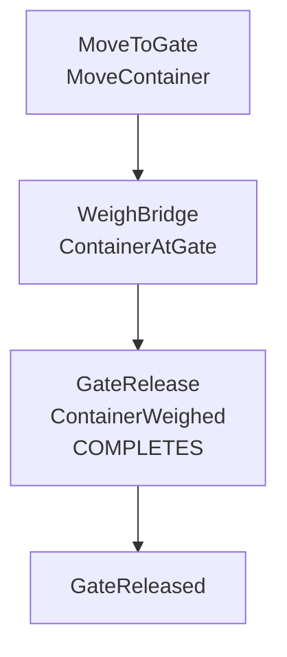
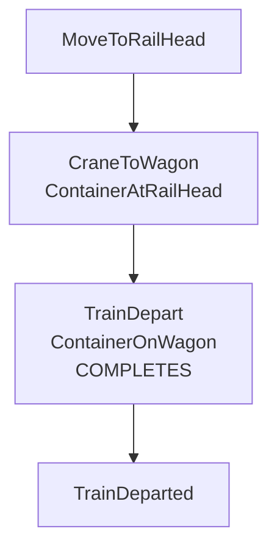

# Flow Choreography Diagrams

## IntermodalTransfer

### YardToTruck

> Choreography: container from yard to truck

```mermaid
flowchart TD
    flow_step_0_movecontainer["MoveToGate<br/>MoveContainer"]
    flow_step_1_containeratgate["WeighBridge<br/>ContainerAtGate"]
    flow_step_2_containerweighed["GateRelease<br/>ContainerWeighed<br/>COMPLETES"]
    flow_target_gatereleased["GateReleased"]
    flow_step_0_movecontainer --> flow_step_1_containeratgate
    flow_step_1_containeratgate --> flow_step_2_containerweighed
    flow_step_2_containerweighed --> flow_target_gatereleased
```

### YardToRail

> Choreography: container from yard to rail wagon

```mermaid
flowchart TD
    flow_step_0_movetorailhead["MoveToRailHead"]
    flow_step_1_containeratrailhead["CraneToWagon<br/>ContainerAtRailHead"]
    flow_step_2_containeronwagon["TrainDepart<br/>ContainerOnWagon<br/>COMPLETES"]
    flow_target_traindeparted["TrainDeparted"]
    flow_step_0_movetorailhead --> flow_step_1_containeratrailhead
    flow_step_1_containeratrailhead --> flow_step_2_containeronwagon
    flow_step_2_containeronwagon --> flow_target_traindeparted
```

