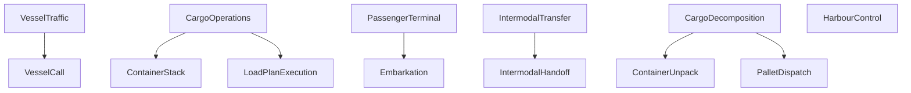

# Org Chart

```mermaid
graph TD
  VesselTraffic["VesselTraffic"]
  VesselTraffic --> VesselTraffic_VesselCall["VesselCall"]
  CargoOperations["CargoOperations"]
  CargoOperations --> CargoOperations_ContainerStack["ContainerStack"]
  CargoOperations --> CargoOperations_LoadPlanExecution["LoadPlanExecution"]
  PassengerTerminal["PassengerTerminal"]
  PassengerTerminal --> PassengerTerminal_Embarkation["Embarkation"]
  IntermodalTransfer["IntermodalTransfer"]
  IntermodalTransfer --> IntermodalTransfer_IntermodalHandoff["IntermodalHandoff"]
  CargoDecomposition["CargoDecomposition"]
  CargoDecomposition --> CargoDecomposition_ContainerUnpack["ContainerUnpack"]
  CargoDecomposition --> CargoDecomposition_PalletDispatch["PalletDispatch"]
  HarbourControl["HarbourControl"]
```
