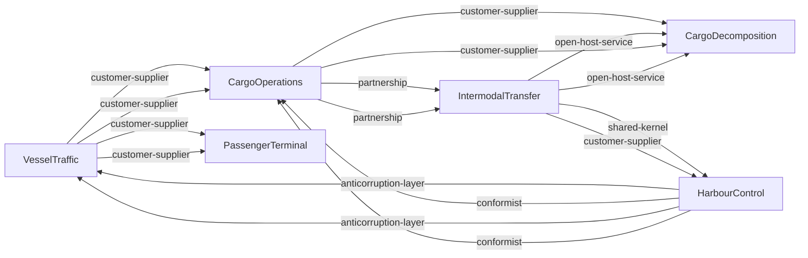

# Team Dependency Report

```mermaid
graph LR
  VesselTraffic["VesselTraffic"]
  CargoOperations["CargoOperations"]
  PassengerTerminal["PassengerTerminal"]
  IntermodalTransfer["IntermodalTransfer"]
  CargoDecomposition["CargoDecomposition"]
  HarbourControl["HarbourControl"]
  VesselTraffic -->|"customer-supplier"| CargoOperations
  VesselTraffic -->|"customer-supplier"| PassengerTerminal
  CargoOperations -->|"partnership"| IntermodalTransfer
  CargoOperations -->|"customer-supplier"| CargoDecomposition
  IntermodalTransfer -->|"open-host-service"| CargoDecomposition
  HarbourControl -->|"anticorruption-layer"| VesselTraffic
  HarbourControl -->|"conformist"| CargoOperations
  IntermodalTransfer -->|"shared-kernel"| HarbourControl
  VesselTraffic -->|"customer-supplier"| CargoOperations
  VesselTraffic -->|"customer-supplier"| PassengerTerminal
  CargoOperations -->|"partnership"| IntermodalTransfer
  CargoOperations -->|"customer-supplier"| CargoDecomposition
  IntermodalTransfer -->|"open-host-service"| CargoDecomposition
  HarbourControl -->|"anticorruption-layer"| VesselTraffic
  HarbourControl -->|"conformist"| CargoOperations
  IntermodalTransfer -->|"customer-supplier"| HarbourControl
```
