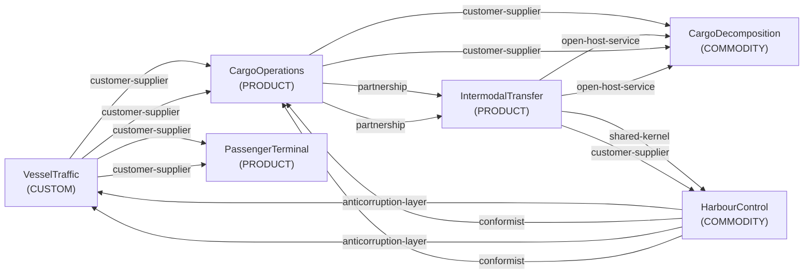

# Wardley Map

## Context Evolution Stages

| Stage | Contexts |
|-------|----------|
| CUSTOM | VesselTraffic |
| PRODUCT | CargoOperations, PassengerTerminal, IntermodalTransfer |
| COMMODITY | CargoDecomposition, HarbourControl |

## Context Map with Evolution

