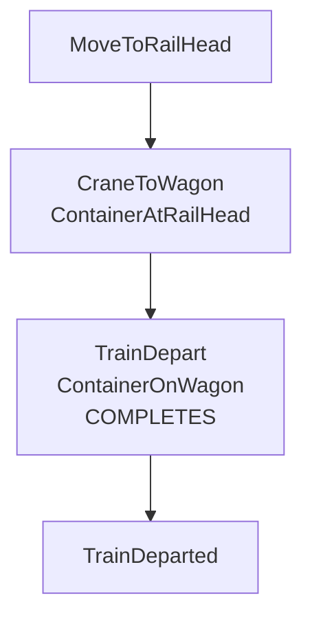

# YardToRail

**Context**: IntermodalTransfer

Choreography: container from yard to rail wagon

## Diagram

```mermaid
flowchart TD
    flow_step_0_movetorailhead["MoveToRailHead"]
    flow_step_1_containeratrailhead["CraneToWagon<br/>ContainerAtRailHead"]
    flow_step_2_containeronwagon["TrainDepart<br/>ContainerOnWagon<br/>COMPLETES"]
    flow_target_traindeparted["TrainDeparted"]
    flow_step_0_movetorailhead --> flow_step_1_containeratrailhead
    flow_step_1_containeratrailhead --> flow_step_2_containeronwagon
    flow_step_2_containeronwagon --> flow_target_traindeparted
```
