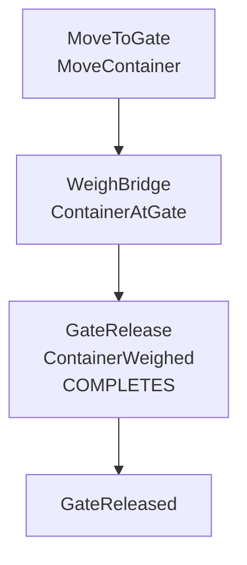

# YardToTruck

**Context**: IntermodalTransfer

Choreography: container from yard to truck

## Diagram

```mermaid
flowchart TD
    flow_step_0_movecontainer["MoveToGate<br/>MoveContainer"]
    flow_step_1_containeratgate["WeighBridge<br/>ContainerAtGate"]
    flow_step_2_containerweighed["GateRelease<br/>ContainerWeighed<br/>COMPLETES"]
    flow_target_gatereleased["GateReleased"]
    flow_step_0_movecontainer --> flow_step_1_containeratgate
    flow_step_1_containeratgate --> flow_step_2_containerweighed
    flow_step_2_containerweighed --> flow_target_gatereleased
```
